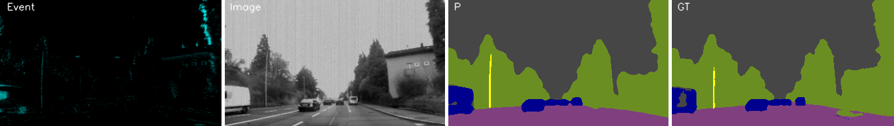
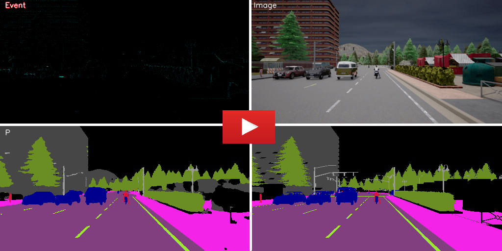
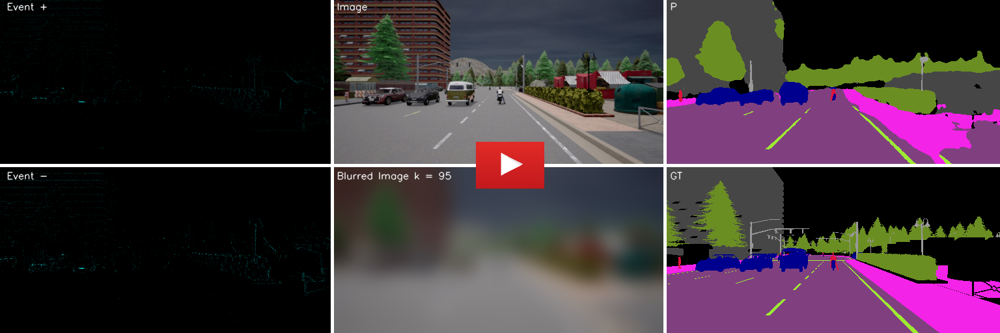

# Event-Frame-Based Semantic Segmentation

This work proposes an Event-Frame based network for semantic segmentation. Our network combines events and frames for boosting the accuracy and robustness of this task. We evaluate our model on DDD17 dataset [[link](https://github.com/Shathe/Ev-SegNet#readme)] and Event-Scape dataset[[link](https://rpg.ifi.uzh.ch/RAMNet.html)] 

## Abstract 
Event cameras are bio-inspired sensors. They have outstanding properties compared to frame-based cameras: high dynamic range (120 vs 60), low latency, and no motion blur. Event cameras are appropriate to use in challenging scenarios such as vision systems in self-driving cars and they have been used for high-level computer vision tasks such as semantic segmentation and depth estimation. In this work, we worked on semantic segmentation using an event camera for self-driving cars. Event-based networks are robust to light conditions but their accuracy is low compared to common frame-based networks, for boosting the accuracy we propose a novel event-frame-based semantic segmentation network that it uses both images and events. We also introduce a novel training method (blurring module), and results show our training method boosts the performance of the network in recognition of small and far objects, and also the network could work when images suffer from blurring.

# Network Architecture


# Requirements
* Python 3.7+
* Tensorflow 2.8 + 
* Opencv
* Keras
* segmentation-models


# Dataset

## DDD17 dataset

**The semantic segmentation classes in DDD17 dataset:** flat, construction+sky, object,  nature,  human, and vehicle

**A video from results:**

[](https://youtu.be/o8nz3FxwzZg)

P: Our network prediction, GT: Ground Truth

**Training**

Please download DDD17 dataset from [here](https://github.com/Shathe/Ev-SegNet) or [here](https://drive.google.com/file/d/1XEUfhho-2g8NH3AYT49zBhDjybHOWAkF/view?usp=sharing), then extract it in DDD17/Dataset directory
```
cd DDD17
python3 train.py
```

**Weights**

Please download Weights from [here](https://drive.google.com/file/d/1R5rA_I4qJEtYdceoXNtHLxYVburyJequ/view?usp=sharing), then extract it in DDD17 directory

**Evaluating**

For revealing the network performance, eval.py creates and saves results in DDD17/output directory
```
cd DDD17
python3 eval.py
```


## Event-Scape dataset

**The semantic segmentation classes in Event-Scape dataset:** ‫‪Unlabeled‬‬‫‪ +‬‬ ‫‪Sky,‬‬ ‫‪Wall‬‬‫‪ +‬‬ ‫‪Fence‬‬ ‫‪+‬‬ ‫‪Building‬‬, Person‬‬, sign‬‬‫‪Traffic‬‬ ‫‪+‬‬ ‫‪Pole‬‬, ‫‪Road‬‬, ‫‪Sidewalk‬‬, Vegetation‬‬, Vehicle‬‬, Road lines

**A video from results:**

[](https://youtu.be/K6tkeT32Yi8)

P: Our network prediction, GT: Ground Truth


**Robustness to blurred images:**

Event-Scape dataset contains high-quality RGB images and there is no failure such as blurring in images so for evaluating the robustness and performance of the model, a wide range of blurred images are fed to the network, and the network’s predictions are shown in this [video](https://www.youtube.com/watch?v=EUNrJiVePPE), results show our network is robust to a wide degree of blurred images although the accuracy decreases with increasing the blurring, outputs are still reliable.

***A video from Robustness Test:***

[](https://www.youtube.com/watch?v=EUNrJiVePPE)

P: Our network prediction, GT: Ground Truth


**Training**

The original Event-Scape dataset is available [here](https://github.com/Shathe/Ev-SegNet) for training and evaluating the network, download the customized Event-Scape dataset from [here](https://drive.google.com/file/d/1XEUfhho-2g8NH3AYT49zBhDjybHOWAkF/view?usp=sharing), then extract it in Event-Scape/Dataset directory
```
cd Event-Scape
python3 train.py
```

**Pre-trained Weights**

Please download Weights from [here](https://drive.google.com/file/d/1-6aRcp5pL3yOHGxm7OCiJWBE3Z9vLbnu/view?usp=sharing), then extract it in Event-Scape directory

**Evaluating**

For revealing the network performance, eval.py creates and saves results in Event-Scape/output directory
```
cd Event-Scape
python3 eval.py
```


