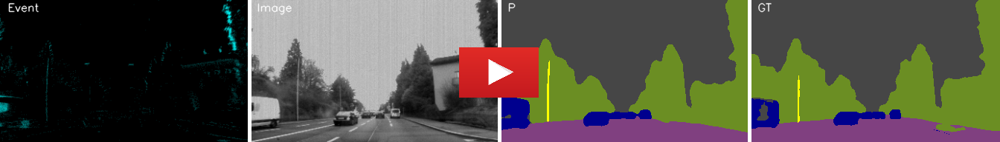

# Event-Frame-Based Semantic Segmentation

This work proposes an Event-Frame based network for semantic segmentation. Our network combines events and frames for boosting the accuracy and robustness of this task. We evaluate our model on DDD17 dataset [[link](https://github.com/Shathe/Ev-SegNet#readme)] and Event-Scape dataset[[link](https://rpg.ifi.uzh.ch/RAMNet.html)] 

# Network Architecture


# Requirements
* Python 3.7+
* Tensorflow 2.8 + 
* Opencv
* Keras
* segmentation-models


# Dataset

## DDD17 dataset

**The semantic segmentation classes in DDD17 dataset:** flat, construction+sky, object,  nature,  human, and vehicle

**A video from results:**

[](https://youtu.be/o8nz3FxwzZg)

P: Our network prediction, GT: Ground Truth

**Training**

Please download DDD17 dataset from [here](https://github.com/Shathe/Ev-SegNet) or [here](https://drive.google.com/file/d/1XEUfhho-2g8NH3AYT49zBhDjybHOWAkF/view?usp=sharing), then extract it in DDD17/Dataset directory
```
cd DDD17
python3 train.py
```

**Pre-trained Weights**

Please download Weights from [here](https://drive.google.com/file/d/1R5rA_I4qJEtYdceoXNtHLxYVburyJequ/view?usp=sharing), then extract it in DDD17 directory

**Evaluating**

For revealing the network performance, eval.py creats and saves results in DDD17/output directory
```
cd DDD17
python3 eval.py
```


## Event-Scape dataset

**The semantic segmentation classes in Event-Scape dataset:** ‫‪Unlabeled‬‬‫‪ +‬‬ ‫‪Sky,‬‬ ‫‪Wall‬‬‫‪ +‬‬ ‫‪Fence‬‬ ‫‪+‬‬ ‫‪Building‬‬, Person‬‬, sign‬‬‫‪Traffic‬‬ ‫‪+‬‬ ‫‪Pole‬‬, ‫‪Road‬‬, ‫‪Sidewalk‬‬, Vegetation‬‬, Vehicle‬‬, Road lines

**A video from results:**

[](https://youtu.be/K6tkeT32Yi8)

P: Our network prediction, GT: Ground Truth

**Training**

Original Event-Scape dataset is avilable [here](https://github.com/Shathe/Ev-SegNet) for training and evaluating the network, download customized Event-Scape dataset from [here](https://drive.google.com/file/d/1XEUfhho-2g8NH3AYT49zBhDjybHOWAkF/view?usp=sharing), then extract it in Event-Scape/Dataset directory
```
cd Event-Scape
python3 train.py
```

**Pre-trained Weights**

Please download Weights from [here](https://drive.google.com/file/d/1-6aRcp5pL3yOHGxm7OCiJWBE3Z9vLbnu/view?usp=sharing), then extract it in Event-Scape directory

**Evaluating**

For revealing the network performance, eval.py creats and saves results in Event-Scape/output directory
```
cd Event-Scape
python3 eval.py
```


